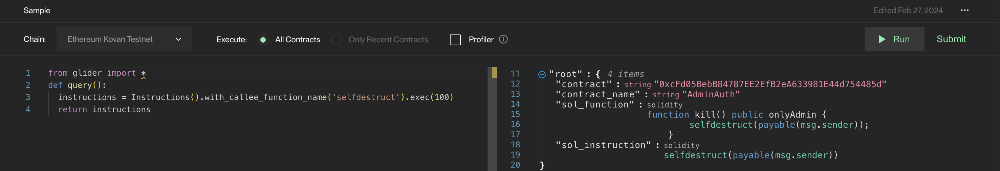

# Usage

### Basic usage

<figure><figcaption>
sample glider code
</figcaption></figure>

In general, Glider provides with a REPL-like interface. On the left side, the glider code is written; on the right side, the output is shown.&#x20;

* To run the query, the researcher needs to press the `Run` button.
* The `Chain` dropdown list is used to select the blockchain on which to run the query.
* The `Execute` clause is used to filter the recent contracts or to run on a full list. This feature is still in development.
* The `Profiler` checkbox is used to show line-by-line profiling information of the execution; this is useful to do benchmarks, reveal bottlenecks and optimize the query code.

### Vulnerability submission

In case the researcher finds a valid bug (with a proven impact) in a smart contract using Glider, he can either submit the bug to the organisation's bug bounty program, if there is any, or even if there is no BB program specified, the researcher can use Remedy's [universal Web3 bug bounty program ](https://r.xyz/programs)which is designed exactly for these situations.

To submit the vulnerability, hit the `Submit` button in the upper-right corner

<figure><figcaption>
submit modal
</figcaption></figure>

Choose `Submit Vulnerability`

#### Advantages of submitting the bug through Remedy

In case the researcher submits a bug through the Remedy universal Web3 bug bounty program, the Remedy team will advocate the process for helping to contact the organization, disclosing the bug in a responsible manner, and advocating for the researcher to receive a reward.&#x20;

Please note that in case the organization has no bug bounty program, then the decision of giving a payout and its amount is solely on the organization's side, although what we can assure is that we will do our best to help you get a fair reward.&#x20;

There are rules for submission, which are present on the universal Web3 program page.&#x20;

As a side-effect, the report will automatically be hashed and committed to the zkEVM blockchain, which will give the ability for further submitters to get [zk proof of duplicate](https://docs.r.xyz/main/v/zk-proof/).&#x20;

### Submitting a query (glider)

To get access to the mainnet queries, by default, only the Kovan testnet is queryable (Kovan was chosen as it was deprecated); one has to contribute three unique critical queries to the open-source Glider [repo](https://github.com/Hexens/glider-query-db).
